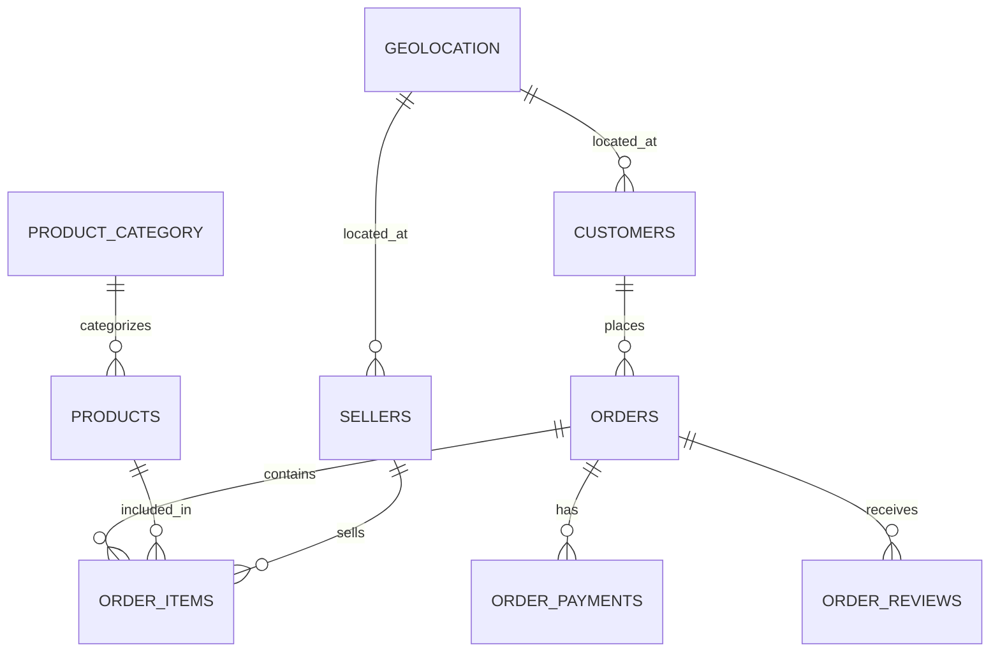

# Olist E-commerce Data Dictionary

This document provides detailed information about the structure and content of the Olist Brazilian E-commerce dataset, including table schemas, column descriptions, data types, and relationships.

## 📋 Table of Contents

- [Dataset Overview](#dataset-overview)
- [Database Schema](#database-schema)
- [Table Definitions](#table-definitions)
- [Data Relationships](#data-relationships)
- [Data Quality Notes](#data-quality-notes)
- [Business Context](#business-context)

## 📊 Dataset Overview

The Olist dataset contains real commercial data from the Brazilian e-commerce platform Olist, spanning from 2016 to 2018. The dataset includes information about:

- **100,000 orders** from multiple marketplaces
- **Orders status, price, payment, and freight performance**
- **Customer location dataset**
- **Product attributes**
- **Customer reviews**

### Data Coverage
- **Time Period**: September 2016 - October 2018
- **Geography**: Brazil (all states)
- **Currency**: Brazilian Real (BRL)
- **Language**: Portuguese/English

## 🗂️ Database Schema



## 📋 Table Definitions

### 1. olist_customers_dataset (public_olist_customers)

Customer information including location and unique identifiers.

| Column | Data Type (Raw) | Data Type (Proposed) | Description | Example |
|--------|----------------|---------------------|-------------|---------|
| `customer_id` | STRING | VARCHAR(32) | **Primary Key** - Unique customer identifier | `9ef432eb6251297304e76186b10a928d` |
| `customer_unique_id` | STRING | VARCHAR(32) | Unique customer identifier across orders | `861eff4711a542e4b93843c6dd7febb0` |
| `customer_zip_code_prefix` | ⚠️ INT64 | VARCHAR(5) | First 5 digits of customer zip code | `01409` (not `1409`) |
| `customer_city` | STRING | VARCHAR(50) | Customer city name | `Franca` |
| `customer_state` | STRING | VARCHAR(2) | Customer state abbreviation | `SP` |

**⚠️ Data Quality Issues:**
- **ZIP Code Data Loss**: `customer_zip_code_prefix` stored as INT64 loses leading zeros
- **Impact**: ZIP codes like `01409` become `1409`, breaking geographic joins
- **Records Affected**: All ZIP codes starting with 0 (São Paulo metropolitan area)

**Business Logic:**
- One customer can have multiple `customer_id` values but same `customer_unique_id`
- ZIP code prefix provides geographic segmentation
- State codes follow Brazilian IBGE standards

---

### 2. olist_orders_dataset (public_olist_orders)

Order information including timestamps, status, and customer references.

| Column | Data Type (Raw) | Data Type (Proposed) | Description | Example |
|--------|----------------|---------------------|-------------|---------|
| `order_id` | STRING | VARCHAR(32) | **Primary Key** - Unique order identifier | `e481f51cbdc54678b7cc49136f2d6af7` |
| `customer_id` | STRING | VARCHAR(32) | **Foreign Key** - Reference to customer | `9ef432eb6251297304e76186b10a928d` |
| `order_status` | STRING | VARCHAR(20) | Current order status | `delivered` |
| `order_purchase_timestamp` | TIMESTAMP | TIMESTAMP | Order creation timestamp | `2017-10-02 10:56:33` |
| `order_approved_at` | ⚠️ STRING | TIMESTAMP | Order approval timestamp | `2017-10-02 11:07:15` |
| `order_delivered_carrier_date` | ⚠️ STRING | TIMESTAMP | Handover to carrier timestamp | `2017-10-04 19:55:00` |
| `order_delivered_customer_date` | ⚠️ STRING | TIMESTAMP | Delivery to customer timestamp | `2017-10-10 21:25:13` |
| `order_estimated_delivery_date` | TIMESTAMP | TIMESTAMP | Estimated delivery date | `2017-10-18 00:00:00` |

**⚠️ Data Quality Issues:**
- **Date Fields as STRING**: Several timestamp fields incorrectly stored as STRING
- **Impact**: Cannot perform proper date calculations without CAST operations
- **Fields Affected**: `order_approved_at`, `order_delivered_carrier_date`, `order_delivered_customer_date`

**Order Status Values:**
- `delivered` - Successfully delivered
- `shipped` - In transit
- `processing` - Being prepared
- `unavailable` - Product unavailable
- `invoiced` - Invoice generated
- `canceled` - Order canceled
- `approved` - Order approved
- `created` - Order created

**Business Logic:**
- Order lifecycle: created → approved → processing → shipped → delivered
- Timestamps track the complete fulfillment process
- Estimated vs actual delivery dates measure performance

---

### 3. olist_order_items_dataset (public_olist_order_items)

Individual items within each order, including pricing and shipping information.

| Column | Data Type (Raw) | Data Type (Proposed) | Description | Example |
|--------|----------------|---------------------|-------------|---------|
| `order_id` | STRING | VARCHAR(32) | **Foreign Key** - Reference to order | `00010242fe8c5a6d1ba2dd792cb16214` |
| `order_item_id` | INT64 | INTEGER | **Primary Key** - Item sequence number | `1` |
| `product_id` | STRING | VARCHAR(32) | **Foreign Key** - Reference to product | `4244733e06e7ecb4970a6e2683c13e61` |
| `seller_id` | STRING | VARCHAR(32) | **Foreign Key** - Reference to seller | `48436dade18ac8b2bce089ec2a041202` |
| `shipping_limit_date` | TIMESTAMP | TIMESTAMP | Latest shipping date | `2017-09-19 09:45:35` |
| `price` | ⚠️ FLOAT64 | DECIMAL(10,2) | Item price in BRL | `58.90` |
| `freight_value` | ⚠️ FLOAT64 | DECIMAL(10,2) | Shipping cost in BRL | `13.29` |

**⚠️ Data Quality Issues:**
- **Financial Precision Loss**: `price` and `freight_value` stored as FLOAT64 instead of DECIMAL
- **Impact**: Potential rounding errors in financial calculations
- **Risk**: Cumulative errors in revenue calculations and reporting

**Business Logic:**
- Composite primary key: (`order_id`, `order_item_id`)
- One order can have multiple items
- Price excludes shipping; freight_value is shipping cost
- Shipping limit date is commitment to carrier

---

### 4. olist_products_dataset (public_olist_products)

Product catalog with dimensions, weight, and category information.

| Column | Data Type (Raw) | Data Type (Proposed) | Description | Example |
|--------|----------------|---------------------|-------------|---------|
| `product_id` | STRING | VARCHAR(32) | **Primary Key** - Unique product identifier | `1e9e8ef04dbcff4541ed26657ea517e` |
| `product_category_name` | STRING | VARCHAR(50) | Product category (Portuguese) | `perfumaria` |
| `product_name_lenght` | INT64 | INTEGER | Character count in product name | `40` |
| `product_description_lenght` | INT64 | INTEGER | Character count in description | `287` |
| `product_photos_qty` | INT64 | INTEGER | Number of product photos | `1` |
| `product_weight_g` | INT64 | INTEGER | Product weight in grams | `225` |
| `product_length_cm` | INT64 | INTEGER | Product length in centimeters | `16` |
| `product_height_cm` | INT64 | INTEGER | Product height in centimeters | `10` |
| `product_width_cm` | INT64 | INTEGER | Product width in centimeters | `14` |

**✅ Data Quality Status:**
- **Mostly Correct**: Numeric fields appropriately stored as INT64
- **No Major Issues**: Product dimensions and counts work well as integers

**Business Logic:**
- Dimensions used for shipping calculations
- Category names in Portuguese (see translation table)
- Weight and dimensions affect shipping costs
- Photo quantity may correlate with conversion rates

---

### 5. olist_sellers_dataset (public_olist_sellers)

Seller information including location and unique identifiers.

| Column | Data Type (Raw) | Data Type (Proposed) | Description | Example |
|--------|----------------|---------------------|-------------|---------|
| `seller_id` | STRING | VARCHAR(32) | **Primary Key** - Unique seller identifier | `3442f8959a84dea7ee197c632cb2df15` |
| `seller_zip_code_prefix` | ⚠️ INT64 | VARCHAR(5) | First 5 digits of seller zip code | `01302` (not `1302`) |
| `seller_city` | STRING | VARCHAR(50) | Seller city name | `Campinas` |
| `seller_state` | STRING | VARCHAR(2) | Seller state abbreviation | `SP` |

**⚠️ Data Quality Issues:**
- **ZIP Code Data Loss**: Same issue as customers table
- **Impact**: Seller location data corrupted, affects delivery time calculations
- **Geographic Joins**: Cannot properly join with geolocation data

**Business Logic:**
- Similar structure to customer data
- Geographic data used for shipping calculations
- Seller location affects delivery times and costs

---

### 6. olist_order_payments_dataset (public_olist_order_payments)

Payment transaction details including methods and installments.

| Column | Data Type (Raw) | Data Type (Proposed) | Description | Example |
|--------|----------------|---------------------|-------------|---------|
| `order_id` | STRING | VARCHAR(32) | **Foreign Key** - Reference to order | `b6f7d83bf71f0c60f5f1a1f9fbb1a5d` |
| `payment_sequential` | INT64 | INTEGER | Payment sequence number | `1` |
| `payment_type` | STRING | VARCHAR(20) | Payment method used | `credit_card` |
| `payment_installments` | INT64 | INTEGER | Number of installments | `8` |
| `payment_value` | ⚠️ FLOAT64 | DECIMAL(10,2) | Payment amount in BRL | `99.33` |

**⚠️ Data Quality Issues:**
- **Financial Precision Loss**: Payment values stored as FLOAT64 instead of DECIMAL
- **Impact**: Potential rounding errors in financial calculations
- **Risk**: Cumulative errors in payment reconciliation

**Payment Types:**
- `credit_card` - Credit card
- `boleto` - Brazilian payment slip
- `voucher` - Voucher/gift card
- `debit_card` - Debit card
- `not_defined` - Unknown method

**Business Logic:**
- Composite primary key: (`order_id`, `payment_sequential`)
- Multiple payments possible per order
- Installments common in Brazilian e-commerce
- Total order value = sum of all payment_value for that order

---

### 7. olist_order_reviews_dataset (public_olist_order_reviews)

Customer reviews and ratings for completed orders.

| Column | Data Type (Raw) | Data Type (Proposed) | Description | Example |
|--------|----------------|---------------------|-------------|---------|
| `review_id` | STRING | VARCHAR(32) | **Primary Key** - Unique review identifier | `7bc2406110b926393aa56f80a40eba40` |
| `order_id` | STRING | VARCHAR(32) | **Foreign Key** - Reference to order | `73fc7af87114b39712e6da79b0a377eb` |
| `review_score` | INT64 | INTEGER | Rating from 1-5 stars | `4` |
| `review_comment_title` | STRING | TEXT | Review title (Portuguese) | `NÃO RECOMENDO` |
| `review_comment_message` | STRING | TEXT | Review content (Portuguese) | `PRODUTO DE QUALIDADE DUVIDOSA...` |
| `review_creation_date` | TIMESTAMP | TIMESTAMP | Review creation timestamp | `2018-01-18 00:00:00` |
| `review_answer_timestamp` | TIMESTAMP | TIMESTAMP | Seller response timestamp | `2018-01-18 21:46:59` |

**✅ Data Quality Status:**
- **Mostly Correct**: Review data types are appropriate
- **Minor Issue**: TEXT fields stored as STRING (acceptable in BigQuery)

**Review Scores:**
- `1` - Very unsatisfied
- `2` - Unsatisfied  
- `3` - Neutral
- `4` - Satisfied
- `5` - Very satisfied

**Business Logic:**
- Reviews written after delivery
- Not all orders have reviews
- Comments in Portuguese
- Review timing affects customer satisfaction analysis

---

### 8. olist_geolocation_dataset (public_olist_geolocation)

Geographic coordinates and location information for Brazilian zip codes.

| Column | Data Type (Raw) | Data Type (Proposed) | Description | Example |
|--------|----------------|---------------------|-------------|---------|
| `geolocation_zip_code_prefix` | ⚠️ INT64 | VARCHAR(5) | **Primary Key** - Zip code prefix | `01037` (not `1037`) |
| `geolocation_lat` | FLOAT64 | DECIMAL(10,8) | Latitude coordinate | `-23.545621` |
| `geolocation_lng` | FLOAT64 | DECIMAL(11,8) | Longitude coordinate | `-46.639292` |
| `geolocation_city` | STRING | VARCHAR(50) | City name | `Sao Paulo` |
| `geolocation_state` | STRING | VARCHAR(2) | State abbreviation | `SP` |

**⚠️ Data Quality Issues:**
- **ZIP Code Data Loss**: Critical issue affecting geographic joins
- **Coordinate Precision**: FLOAT64 may lose precision for exact coordinates
- **Impact**: Cannot join customers/sellers with geolocation data properly

**Business Logic:**
- Used for distance calculations
- Enables shipping time and cost analysis
- Geographic clustering for market analysis
- Coordinates in decimal degrees (WGS84)

---

### 9. product_category_name_translation (public_product_category_name_translation)

Translation mapping for product categories from Portuguese to English.

| Column | Data Type (Raw) | Data Type (Proposed) | Description | Example |
|--------|----------------|---------------------|-------------|---------|
| `product_category_name` | STRING | VARCHAR(50) | **Primary Key** - Portuguese category name | `beleza_saude` |
| `product_category_name_english` | STRING | VARCHAR(50) | English translation | `health_beauty` |

**✅ Data Quality Status:**
- **Correct**: Both fields appropriately stored as STRING

**Category Examples:**
- `auto` → `auto`
- `bebe` → `baby`
- `beleza_saude` → `health_beauty`
- `casa_conforto_2` → `home_comfort_2`
- `informatica_acessorios` → `computers_accessories`

## 🔗 Data Relationships

### Primary Relationships

1. **Customer → Orders**: One-to-Many
   - `customers.customer_id` → `orders.customer_id`

2. **Orders → Order Items**: One-to-Many
   - `orders.order_id` → `order_items.order_id`

3. **Orders → Payments**: One-to-Many
   - `orders.order_id` → `order_payments.order_id`

4. **Orders → Reviews**: One-to-One (optional)
   - `orders.order_id` → `order_reviews.order_id`

5. **Products → Order Items**: One-to-Many
   - `products.product_id` → `order_items.product_id`

6. **Sellers → Order Items**: One-to-Many
   - `sellers.seller_id` → `order_items.seller_id`

### Geographic Relationships

1. **Geolocation → Customers**: One-to-Many
   - `geolocation.geolocation_zip_code_prefix` → `customers.customer_zip_code_prefix`

2. **Geolocation → Sellers**: One-to-Many
   - `geolocation.geolocation_zip_code_prefix` → `sellers.seller_zip_code_prefix`

### Category Relationships

1. **Product Categories → Products**: One-to-Many
   - `product_category_name_translation.product_category_name` → `products.product_category_name`

## 📈 Key Business Metrics

### Order Metrics
- **Order Value**: Sum of `order_items.price` + `order_items.freight_value`
- **Order Count**: Count of unique `order_id`
- **Average Order Value (AOV)**: Total order value / order count

### Fulfillment Metrics
- **Processing Time**: `order_approved_at` - `order_purchase_timestamp`
- **Shipping Time**: `order_delivered_carrier_date` - `order_approved_at`
- **Delivery Time**: `order_delivered_customer_date` - `order_delivered_carrier_date`
- **Total Lead Time**: `order_delivered_customer_date` - `order_purchase_timestamp`

### Customer Metrics
- **Customer Lifetime Value**: Total spending per `customer_unique_id`
- **Repeat Purchase Rate**: Customers with multiple orders
- **Geographic Distribution**: Orders by state/city

### Product Metrics
- **Category Performance**: Sales by `product_category_name`
- **Product Popularity**: Order frequency by `product_id`
- **Review Scores**: Average `review_score` by product/category

### Seller Metrics
- **Seller Performance**: Orders and revenue by `seller_id`
- **Geographic Coverage**: Seller distribution by state
- **Fulfillment Performance**: Delivery times by seller

## 🔍 Data Quality Notes

### ⚠️ Critical Data Type Issues

#### **ZIP Code Data Loss (CRITICAL)**
- **Affected Tables**: `public_olist_customers`, `public_olist_sellers`, `public_olist_geolocation`
- **Issue**: ZIP codes stored as INT64 lose leading zeros
- **Impact**: Geographic analysis severely compromised
- **Example**: `01409` (São Paulo) becomes `1409`
- **Records Affected**: All ZIP codes starting with 0 (major metropolitan areas)
- **Fix Required**: Cast to STRING with LPAD function or reload with correct schema

#### **Timestamp Field Issues (HIGH)**
- **Affected Table**: `public_olist_orders`
- **Issue**: Critical date fields stored as STRING instead of TIMESTAMP
- **Affected Fields**: `order_approved_at`, `order_delivered_carrier_date`, `order_delivered_customer_date`
- **Impact**: Cannot perform date calculations without casting
- **Fix Required**: CAST to TIMESTAMP or reload with correct schema

#### **Financial Precision Issues (MEDIUM)**
- **Affected Tables**: `public_olist_order_items`, `public_olist_order_payments`
- **Issue**: Financial values stored as FLOAT64 instead of DECIMAL
- **Impact**: Potential rounding errors in financial calculations
- **Risk**: Cumulative errors in revenue reporting

### Missing Values
- **Order Reviews**: Not all orders have reviews (~57% coverage)
- **Order Timestamps**: Some delivery dates may be null for undelivered orders
- **Product Dimensions**: Some products missing weight/dimension data
- **Review Comments**: Not all reviews have comment text

### Data Anomalies
- **Duplicate Coordinates**: Multiple zip codes may share coordinates
- **Product Categories**: Some products have no category assigned
- **Payment Values**: Occasional discrepancies between order total and payment sum

### Data Validation Rules
- **Order Status Consistency**: Delivered orders must have delivery timestamps
- **Geographic Consistency**: ZIP codes must match city/state combinations (affected by INT64 issue)
- **Payment Validation**: Payment sum should equal order total (price + freight)
- **Review Timing**: Review dates should be after delivery dates

### Workaround Queries

Until schema is fixed, use these patterns:

```sql
-- Fix ZIP codes (pad with leading zeros)
SELECT 
  LPAD(CAST(customer_zip_code_prefix AS STRING), 5, '0') as fixed_zip_code
FROM `extended-legend-470014-n7.olist_raw.public_olist_customers`;

-- Fix timestamp fields
SELECT 
  CAST(order_approved_at AS TIMESTAMP) as order_approved_at_fixed
FROM `extended-legend-470014-n7.olist_raw.public_olist_orders`
WHERE order_approved_at IS NOT NULL AND order_approved_at != '';

-- Ensure financial precision
SELECT 
  ROUND(CAST(price AS NUMERIC), 2) as price_fixed
FROM `extended-legend-470014-n7.olist_raw.public_olist_order_items`;
```

## 💼 Business Context

### Olist Business Model
Olist connects small businesses to marketplaces without hassle and with a single contract. Those merchants are able to sell their products through the Olist Store and ship them directly to the customers using Olist logistics partners.

### Marketplace Integration
- **Multiple Marketplaces**: Mercado Livre, Amazon, etc.
- **Unified Management**: Single dashboard for sellers
- **Logistics Network**: Integrated shipping solutions

### Revenue Streams
1. **Commission**: Percentage of each sale
2. **Logistics**: Shipping and fulfillment fees
3. **Services**: Marketing and business intelligence tools

## 📊 Analysis Use Cases

### Customer Analytics
- **Segmentation**: Geographic, behavioral, value-based
- **Churn Analysis**: Customer retention patterns
- **Lifetime Value**: Revenue prediction and optimization

### Product Analytics
- **Category Performance**: Best-selling categories and trends
- **Inventory Optimization**: Demand forecasting
- **Pricing Strategy**: Price elasticity analysis

### Operational Analytics
- **Fulfillment Optimization**: Delivery time reduction
- **Seller Performance**: Marketplace efficiency
- **Geographic Expansion**: Market opportunity identification

### Financial Analytics
- **Revenue Analysis**: Trend analysis and forecasting
- **Payment Method Optimization**: Conversion rate by payment type
- **Profitability Analysis**: Margin analysis by category/region

## 🔧 Technical Notes

### Data Types
- **Timestamps**: All in UTC timezone
- **Decimals**: Prices in Brazilian Real (BRL) with 2 decimal places
- **Text Fields**: UTF-8 encoding (Portuguese content)
- **IDs**: 32-character hexadecimal strings

### Performance Considerations
- **Partitioning**: Consider partitioning by `order_purchase_timestamp`
- **Indexing**: Index on foreign keys and frequently queried columns
- **Clustering**: Cluster by geography or time for analytics workloads

### Data Lineage
- **Source**: Olist transactional systems
- **Extraction**: PostgreSQL database (Supabase)
- **Processing**: Meltano ETL pipeline
- **Target**: Google BigQuery (`olist_raw` dataset)

## 📚 References

- **Olist Official Dataset**: [Kaggle - Brazilian E-Commerce](https://www.kaggle.com/datasets/olistbr/brazilian-ecommerce)
- **Olist Company**: [Official Website](https://olist.com/)
- **Brazilian Geography**: [IBGE Geographic Codes](https://www.ibge.gov.br/)
- **Currency Information**: [Brazilian Real (BRL)](https://www.bcb.gov.br/)

## 📋 Sample Queries

### Customer Analysis
```sql
-- Customer distribution by state (with ZIP code fix)
SELECT 
    customer_state,
    COUNT(DISTINCT customer_unique_id) as unique_customers,
    COUNT(*) as total_orders
FROM `extended-legend-470014-n7.olist_raw.public_olist_customers` c
JOIN `extended-legend-470014-n7.olist_raw.public_olist_orders` o 
    ON c.customer_id = o.customer_id
GROUP BY customer_state
ORDER BY unique_customers DESC;
```

### Order Performance
```sql
-- Average delivery time by state (with timestamp casting)
SELECT 
    c.customer_state,
    AVG(DATE_DIFF(
        CAST(o.order_delivered_customer_date AS TIMESTAMP), 
        o.order_purchase_timestamp, 
        DAY
    )) as avg_delivery_days
FROM `extended-legend-470014-n7.olist_raw.public_olist_orders` o
JOIN `extended-legend-470014-n7.olist_raw.public_olist_customers` c 
    ON o.customer_id = c.customer_id
WHERE o.order_status = 'delivered'
    AND o.order_delivered_customer_date IS NOT NULL 
    AND o.order_delivered_customer_date != ''
GROUP BY c.customer_state
ORDER BY avg_delivery_days;
```

### Revenue Analysis
```sql
-- Monthly revenue trend (with financial precision)
SELECT 
    DATE_TRUNC(order_purchase_timestamp, MONTH) as month,
    COUNT(DISTINCT o.order_id) as orders,
    ROUND(SUM(CAST(oi.price AS NUMERIC) + CAST(oi.freight_value AS NUMERIC)), 2) as total_revenue
FROM `extended-legend-470014-n7.olist_raw.public_olist_orders` o
JOIN `extended-legend-470014-n7.olist_raw.public_olist_order_items` oi 
    ON o.order_id = oi.order_id
WHERE o.order_status = 'delivered'
GROUP BY month
ORDER BY month;
```

### Geographic Analysis (Fixed ZIP Codes)
```sql
-- Customer-Seller distance analysis with fixed ZIP codes
SELECT 
    c.customer_state,
    s.seller_state,
    COUNT(*) as order_count,
    AVG(DATE_DIFF(
        CAST(o.order_delivered_customer_date AS TIMESTAMP), 
        o.order_purchase_timestamp, 
        DAY
    )) as avg_delivery_days
FROM `extended-legend-470014-n7.olist_raw.public_olist_orders` o
JOIN `extended-legend-470014-n7.olist_raw.public_olist_customers` c ON o.customer_id = c.customer_id
JOIN `extended-legend-470014-n7.olist_raw.public_olist_order_items` oi ON o.order_id = oi.order_id
JOIN `extended-legend-470014-n7.olist_raw.public_olist_sellers` s ON oi.seller_id = s.seller_id
WHERE o.order_status = 'delivered'
    AND o.order_delivered_customer_date IS NOT NULL
    AND o.order_delivered_customer_date != ''
GROUP BY c.customer_state, s.seller_state
HAVING COUNT(*) > 10
ORDER BY avg_delivery_days;
```

---

**Document Version**: 2.0  
**Last Updated**: August 30, 2025  
**Dataset Version**: Olist Brazilian E-commerce (2016-2018)  
**Pipeline Target**: BigQuery `olist_raw` dataset  
**Schema Status**: ⚠️ Contains data type issues requiring fixes
